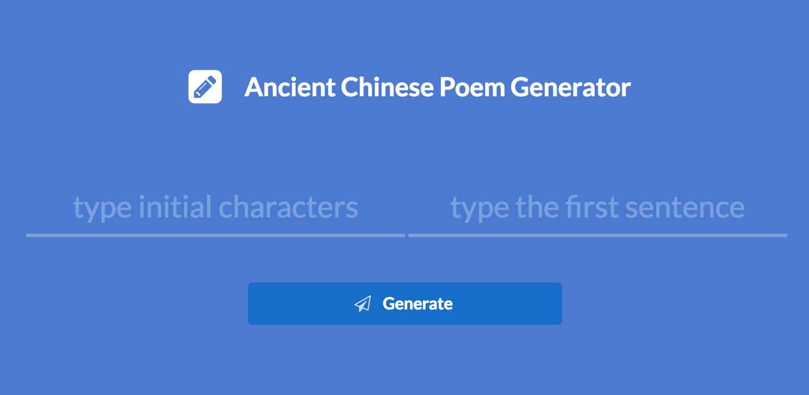

# Poem Generator User Interface

This is the UI which takes user input to invoke the poem generation and display generated results.

## How to Run

> You need to have Node.js installed.

```sh
npm install
npm start
// visit http://localhost:3000
```

## Tech Stack

+ Express JS framework
+ jQuery
+ Semantic UI

## Screenshot



